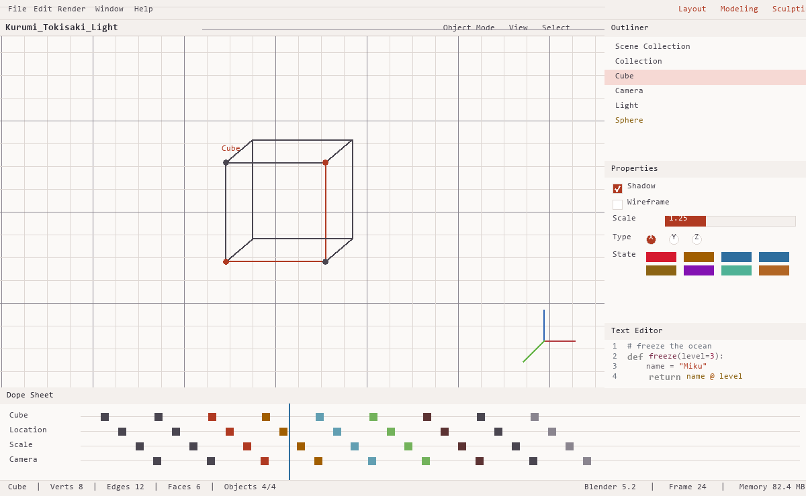
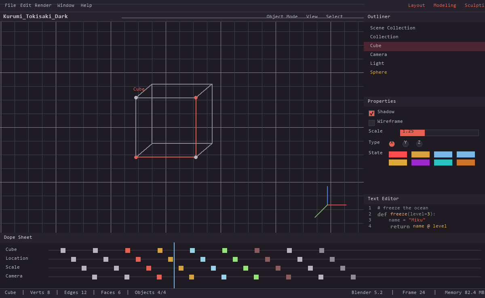
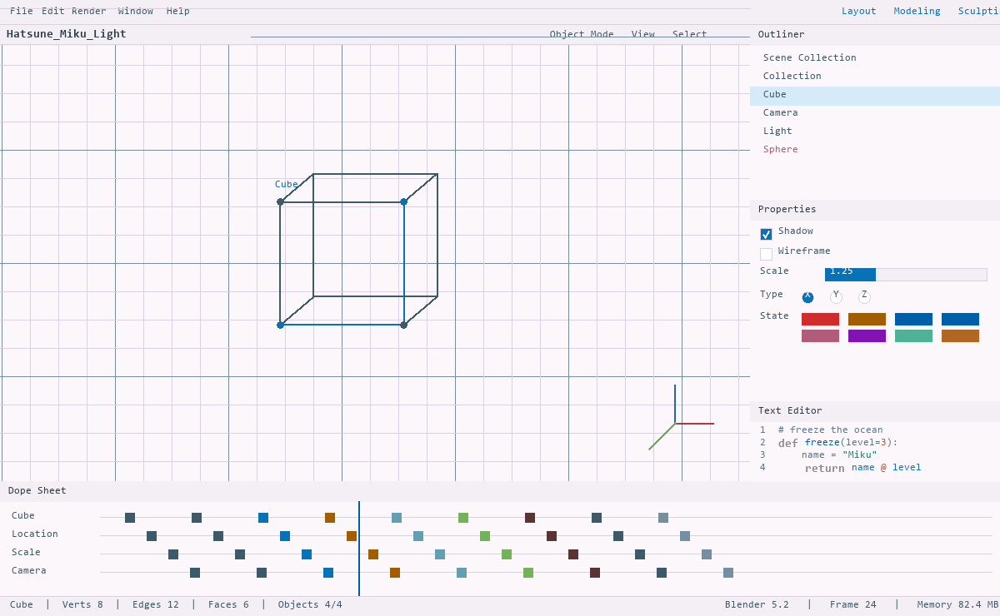
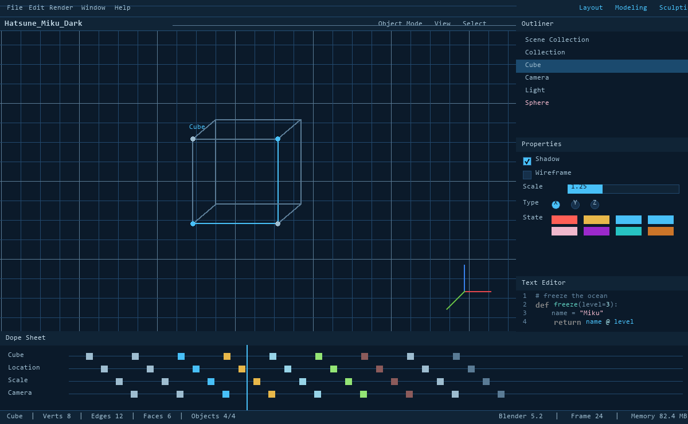
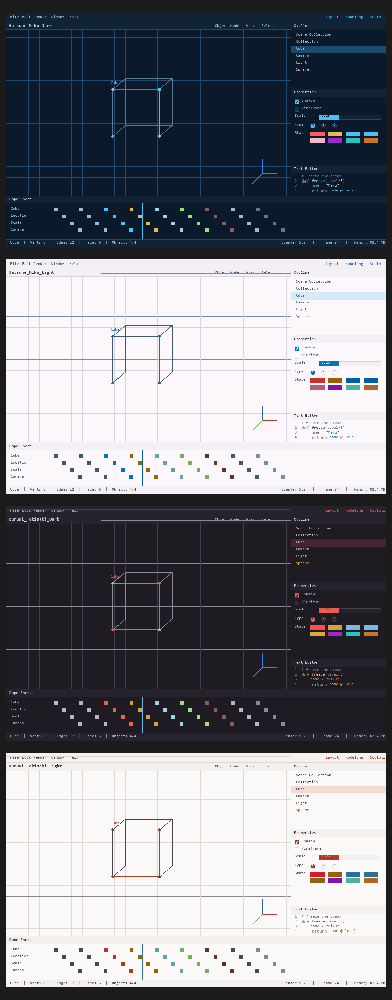

# Blender 主题 × 4（时崎狂三 / 初音未来）

配色取自 `C:\Users\kb\Pictures\时崎狂三.png` 与 `E:\下载\初音未来.jpeg` 的实际像素。
IntelliJ IDEA 版本是独立仓库 `idea-anime-themes`（本机与 `../idea_themes/` 并列）。
两边共用同一套角色色值：本主题文本编辑器的
**8 个语法高亮属性与 IDEA 配色方案逐字节一致**——这是校验脚本逐条比对出来的，不是声称。

Blender 没有独立的「关键字」属性：Python 关键字落在 `syntax_reserved` 桶里，所以那个桶承担
主题的关键字色。

| 主题 | 基调 | 视口背景 | 关键字/语义色系 |
|---|---|---|---|
| Kurumi Tokisaki Dark | 炭黑 | `#1E1C22` | 金色字节 `#E0A838` + 朱红强调 |
| Kurumi Tokisaki Light | 暖白 | `#FBF9F7` | 金色字节 `#8C6414` + 朱红强调 |
| Hatsune Miku Dark | 深海蓝 | `#0B1A2A` | 亮青 `#48C0F8` + 玫瑰 |
| Hatsune Miku Light | 暖粉白 | `#FBF7FA` | 天蓝 `#0777BF` + 深青 |

## 交付物

| 文件 | 大小 | 说明 |
|---|---|---|
| `dist/Kurumi_Tokisaki_Dark.zip` 等 4 个 | 约 5.9 KB | **扩展包**，`blender_manifest.toml` + 主题 XML |
| `dist/Kurumi_Tokisaki_Dark.xml` 等 4 个 | 约 53 KB | 原始主题文件，也可直接放进 `scripts/presets/interface_theme/` |
| `dist/preview_*.png` | — | 四套完整界面模拟图（视口、大纲、属性、文本编辑器、时间轴） |
| `dist/*.xml.probe.json` | — | 校验清单，`verify_theme.py` 用它回读每个颜色 |

## 预览

四套主题的完整界面模拟——3D 视口、大纲、属性面板、文本编辑器、时间轴都在主题范围内：

| | |
|---|---|
| **Kurumi Tokisaki Light**<br> | **Kurumi Tokisaki Dark**<br> |
| **Hatsune Miku Light**<br> | **Hatsune Miku Dark**<br> |

四套叠放（`dist/preview_all.png`）：



模拟图里的颜色是从生成的 XML 里**回读**出来的，不是另抄一份色表，所以预览与主题文件一致。

## 安装

**方式 A：扩展包（推荐，Blender 4.2+）**

`dist/*.zip` 是标准 Blender 扩展包（`blender_manifest.toml` + 主题 XML），和你给的
`theme-shadow`、`theme-dark-purple-green` 是同一格式：

> `Edit → Preferences → Get Extensions → 右上角 ▾ → Install from Disk…` 选 zip，
> 或者直接把 zip 拖进 Blender 窗口。装完到 `Preferences → Themes` 里选。

**方式 B：直接放文件**

把 `dist/*.xml` 复制到 `scripts/presets/interface_theme/` 下，重启后到
`Preferences → Themes` 选。用户目录（无需管理员权限）：

```
%APPDATA%\Blender Foundation\Blender\5.2\scripts\presets\interface_theme\
%APPDATA%\Blender Foundation\Blender\4.5\scripts\presets\interface_theme\
```

装之前想看效果：`dist/preview_*.png` 是四套完整界面模拟图（视口、大纲、属性面板、
文本编辑器、时间轴），`dist/preview_all.png` 是汇总。

## 兼容范围

**一个文件同时兼容 4.5、5.0、5.2**，因为 Blender 在 4.x→5.x 之间改了一大批属性名
（`frame_current`→`playhead`、`sub_back`→`panel_sub_back`、`edge_seam`→`seam`…），
生成的文件带的是**各版本属性名的并集**。Blender 会忽略它不认识的属性名，所以
每个版本读到自己认识的那部分。扩展包声明 `blender_version_min = "4.5.0"`。

控制台里会出现一串 `not found` 警告，就是版本不认识的那部分属性——正常现象，
不影响使用。5.2 下每份约 400 条（对应 4.5 独有属性名），4.5 下约 90 条（对应 5.2 新增的）。

## 内容规模

每份约 1210 个属性（其中约 1050 个颜色），覆盖 3D 视口、大纲、属性、节点编辑器、
时间轴 / 摄影表 / NLA / 曲线编辑器、图像 / 序列 / 剪辑 / 文件浏览器、文本编辑器、
控制台、信息栏、顶栏、状态栏；

以及 20 组骨骼配色、8 个集合色、9 个片段色、网格与线框、`crease`/`seam`/`sharp`/`bevel`/
`freestyle` 语义彩虹、Gizmo 轴色、节点类别色、关键帧各状态色、部件状态色
（错误 / 警告 / 信息 / 成功 / 动画 / 关键帧 / 驱动 / 覆盖 / 变更）。

作为对照：Blender 自己保存的主题约 792 个属性，本主题在 5.2 下被识别的部分为 786 个，
另有 408 个 4.5 旧属性名——即**完整的 5.2 覆盖 + 旧版本兼容**。

## 设计取舍

**视口背景直接等于编辑器配色方案的底色**（深色为 `#1E1C22` / `#0B1A2A`）。本来为了
让视口不那么黑而提亮过，但那会破坏语法高亮——文本编辑器的颜色是从 IDEA 配色方案继承的，
它们的对比度是对着原底色实测验证的。改用原底色后，两个产品的同一套语法色完全一致。
所以深色视口偏黑，线框因此反过来用浅色（`wire` 取 `fg3`），而不是照抄 Blender 深色主题的纯黑线框
（那是配它自己的中灰视口用的）。

**语义色保 Blender 的色相。** `crease` 品红、`sharp` 青、`bevel` 蓝、`freestyle` 绿、
节点类别色、集合与片段色阶——这些色相是建模时的心智模型，改掉会让人困惑。所以它们只按主题
重调饱和度与明度，色相不动。

**表面色、文字色、选中色、高亮色直接用动漫调色板。**

**注释色曾经与 IDEA 侧不同，现已统一。** IDEA 的 `comment` 角色同时出现在多个背景上，
它的可读性修正会对着所有这些背景收敛；本主题原先直接读 `roles.py` 的原始值、只针对单一背景
修正，于是同一条注释在两边深浅不同。现在生成器先跑一遍 IDEA 那道修正，取同一批收敛值。

**一条曾经走偏的处理。** 我曾以为 `syntax_reserved` 会与关键字撞色，于是让它保留 Blender 的
褐色；实际 Blender 的 `ThemeTextEditor` **没有 `syntax_keyword` 属性**（三个参考源与 RNA 都确认），
Python 关键字本就落在 `syntax_reserved` 里——所以那个桶应该承担主题的关键字色。改正后
8 个共享属性才真正与 IDEA 侧一致。

**初音深色的视口底 `#0B1A2A`、注解淡紫等为衍生值**，源图完全没有暗部。

## 可读性保证

生成器对每个前景强制 WCAG 对比度下界，不达标只调明度（保色相与饱和度）：

| 类别 | 下界 |
|---|---|
| 语法高亮 | 4.5（注释 3.9） |
| 控制台各级输出 | 4.5 |
| 各空间正文 / 标题 / 页眉文字 | 2.6（深色）/ 2.8（浅色），线框与薄元素对比较低是刻意的 |
| 部件文字（含选中态） | 2.6 / 2.8 |

## 重新生成

```bash
python blender_themes.py     # 4 个 XML + 4 个扩展 zip，并打印映射缺口与对比度记录
python preview_blender.py    # 界面模拟图（颜色从生成的 XML 回读，不是另抄一份）
```

**构建可复现**：zip 条目时间戳被固定，相同输入产出相同字节，连续两次构建哈希一致。

## 校验值

| 文件 | SHA-256 |
|---|---|
| `dist/Kurumi_Tokisaki_Dark.zip` | `3f1399cd7d3e1158eb1568f6c26802adce488b6dd8e596b5d6d998a6a98cce32` |
| `dist/Kurumi_Tokisaki_Light.zip` | `9fc98da9eaecc006a8f0a44dd1a40257d36428c071b7af41f67e6ae2d73c3ef2` |
| `dist/Hatsune_Miku_Dark.zip` | `f38117cf96cc7bcc1b41f17f944d48d2ead802a3521550dc4ac41efef35922b7` |
| `dist/Hatsune_Miku_Light.zip` | `b17983c05d4df0c08c3f554aa0b07645eb1697f2c6152c687261902e7658cc33` |
| `dist/Kurumi_Tokisaki_Dark.xml` | `b94dcfd842fd3bea351afb42a43d2a4d6b300e717c58fa79966263d3eabd1bb0` |
| `dist/Kurumi_Tokisaki_Light.xml` | `4e7d1465212d7d609a8de2bd918d83cdeb197cecc302d651fa2009739b49e90b` |
| `dist/Hatsune_Miku_Dark.xml` | `2af48ba64f7f926f8ce9b11d45ca01777a268a8cb65984049ca88dc21d6bc96e` |
| `dist/Hatsune_Miku_Light.xml` | `719d6cde122e3a2e8762179e98d3c1a453efc6a5d7c81e39cebb14a27ab1eb86` |

验证（需要 Blender 本体）：

```bash
blender -b --factory-startup --python verify_theme.py -- <dist 目录绝对路径>
```

它会加载每份主题，把**每一个颜色属性逐个通过 RNA 回读**与写入值比对。结果：

| Blender | 精确匹配 | 该版本不认识（跳过） | 不一致 |
|---|---|---|---|
| 5.2.0 LTS | 2572 | 1632 | **0** |
| 4.5.12 LTS | 3852 | 352 | **0** |

`blender --command extension validate <zip>` 也会通过；但注意它**只校验清单/TOML**，
对「包里有清单却没主题 XML」也放行，所以真正的保证来自上面的回读验证。

## 参考来源

结构与属性名不是猜的，全部取自 Blender 自身：

| 来源 | 用途 |
|---|---|
| `<blender>/<ver>/scripts/presets/interface_theme/Blender_Light.xml` | 官方浅色预设，结构与属性名基准 |
| `blender/dark_<ver>.xml`（由 `dump_theme.py` 导出） | 深色基准——Blender 自带的 `Blender_Dark.xml` 是空存根，真正的深色主题在 C 默认值里 |
| 用户提供的 `theme-shadow-v5.0.2.zip`、`theme-dark-purple-green-v1.0.1.zip` | 扩展包格式与 `blender_manifest.toml` 字段的对照 |

`dump_theme.py` 通过 RNA 反射导出当前主题；颜色是普通 sRGB 字节值
（已实测确认：XML `#999999` 对应 RNA 0.6 = 153/255），所以转换就是 `round(v*255)`。
`<ThemeStyle>` 不在 `Theme` 之下，它对应的是界面字体样式（`preferences.ui_styles`），
导出脚本按这个位置写。

## 授权

主题的结构、属性名与全部非颜色取值都来自 GPL 授权的 Blender 数据，因此扩展包声明
`SPDX:GPL-2.0-or-later`。
